```mermaid
%%{init: {
    'theme': 'base',
    'themeVariables': {
        'fontFamily': 'Microsoft YaHei, SimHei, Arial',
        'fontSize': '14px',
        'primaryColor': '#E3F2FD',
        'primaryTextColor': '#1565C0',
        'primaryBorderColor': '#1976D2',
        'lineColor': '#2196F3',
        'secondaryColor': '#BBDEFB',
        'tertiaryColor': '#FFFFFF',
        'edgeLabelBackground': '#FFFFFF'
    },
    'flowchart': {
        'htmlLabels': true,
        'curve': 'basis',
        'nodeSpacing': 50,
        'rankSpacing': 60,
        'padding': 15
    }
}}%%
flowchart TD
    %% 开始节点
    START(["<b>开始</b>"]):::primary
    
    %% 系统初始化
    INIT["<b>系统初始化</b><br/><font size='12'>(配置参数、初始化解码器)</font>"]:::secondary
    
    %% 采集数据
    COLLECT["<b>采集AIS数据帧</b><br/><font size='12'>(从网口/文件/串口接收)</font>"]:::secondary
    
    %% 判断采集
    CHECK_COLLECT{"<b>是否采集完<br/>1帧？</b>"}:::decision
    
    %% BCC校验
    BCC["<b>调用BCC校验程序</b><br/><font size='12'>(位异或校验)</font>"]:::secondary
    
    %% 判断BCC
    CHECK_BCC{"<b>BCC校验<br/>是否通过？</b>"}:::decision
    
    %% ASCII转6bit
    ASCII_6BIT["<b>8位ASCII码转换为<br/>6位二进制码</b>"]:::secondary
    
    %% 识别消息ID
    IDENTIFY_ID["<b>识别消息ID</b><br/><font size='12'>(判断消息类型1-27)</font>"]:::secondary
    
    %% 分配bit
    SPLIT_BITS["<b>分配bit</b><br/><font size='12'>(按字段定义切分位流)</font>"]:::secondary
    
    %% 二进制转十进制
    BIN_TO_DEC["<b>二进制码转换为十进制</b>"]:::secondary
    
    %% 十进制转字符
    DEC_TO_CHAR["<b>十进制转字符</b><br/><font size='12'>(船名等文本字段)</font>"]:::secondary
    
    %% 信息显示
    DISPLAY["<b>信息显示</b><br/><font size='12'>(输出解析结果)</font>"]:::secondary
    
    %% 结束节点
    END(["<b>结束</b>"]):::primary
    
    %% 主流程
    START --> INIT
    INIT --> COLLECT
    COLLECT --> CHECK_COLLECT
    
    CHECK_COLLECT -->|"<b>否</b>"| COLLECT
    CHECK_COLLECT -->|"<b>是</b>"| BCC
    
    BCC --> CHECK_BCC
    CHECK_BCC -->|"<b>否</b>"| DISCARD["<b>丢弃或报错</b><br/><font size='12'>(记录错误信息)</font>"]:::warning
    DISCARD --> COLLECT
    
    CHECK_BCC -->|"<b>是</b>"| ASCII_6BIT
    ASCII_6BIT --> IDENTIFY_ID
    IDENTIFY_ID --> SPLIT_BITS
    SPLIT_BITS --> BIN_TO_DEC
    BIN_TO_DEC --> DEC_TO_CHAR
    DEC_TO_CHAR --> DISPLAY
    DISPLAY --> END
    
    %% 循环回下一帧
    DISPLAY -.->|"<b>循环采集<br/>下一帧</b>"| COLLECT
    
    %% 样式定义
    classDef primary fill:#1976D2,stroke:#0D47A1,stroke-width:3px,color:#FFFFFF,font-weight:bold
    classDef secondary fill:#E3F2FD,stroke:#1976D2,stroke-width:3px,color:#1565C0,font-weight:bold
    classDef decision fill:#FFF3E0,stroke:#FF9800,stroke-width:3px,color:#E65100,font-weight:bold
    classDef warning fill:#FFEBEE,stroke:#F44336,stroke-width:3px,color:#C62828,font-weight:bold
```

## 流程说明

### 流程概述

该流程图描述了AIS消息从采集到解析的完整过程：

1. **数据采集阶段**：系统初始化后，从网口/文件/串口采集AIS数据帧
2. **数据校验阶段**：对采集的数据进行BCC位异或校验
3. **数据解析阶段**：将通过校验的数据进行格式转换和字段提取
4. **结果显示阶段**：将解析结果输出显示，并循环处理下一帧

### 关键步骤说明

| 步骤 | 说明 |
|------|------|
| BCC校验 | 对AIS消息进行位异或校验，确保数据完整性 |
| ASCII→6bit | 将标准8位ASCII字符转换为AIS专用的6位填充码 |
| 消息ID识别 | 根据消息ID判断消息类型（1-27），确定后续解析规则 |
| 位流切分 | 按AIS协议字段定义，将连续位流分割为各字段 |
